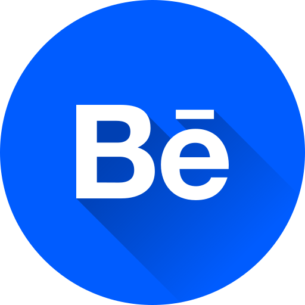

<!-- banner -->

  

<h2 align="left">Hi 👋, I'm Aslam Dhikrullahi</h2><h3 align="left">A designer and aspiring developer.</h3>

- 🔭 I’m interested in **using code to create design.**
- 🌱 I’m currently learning **HTML, CSS, JavaScript & Python.**
- 📫 Reach me on **a.adepoju23@gmail.com**

<h3 align="left">Connect with me:</h3>

<h3 align="left">Languages and Tools:</h3>

         

&nbsp;

 

<!---
aslam-adigun/aslam-adigun is a ✨ special ✨ repository because its `README.md` (this file) appears on your GitHub profile.
You can click the Preview link to take a look at your changes.
--->
